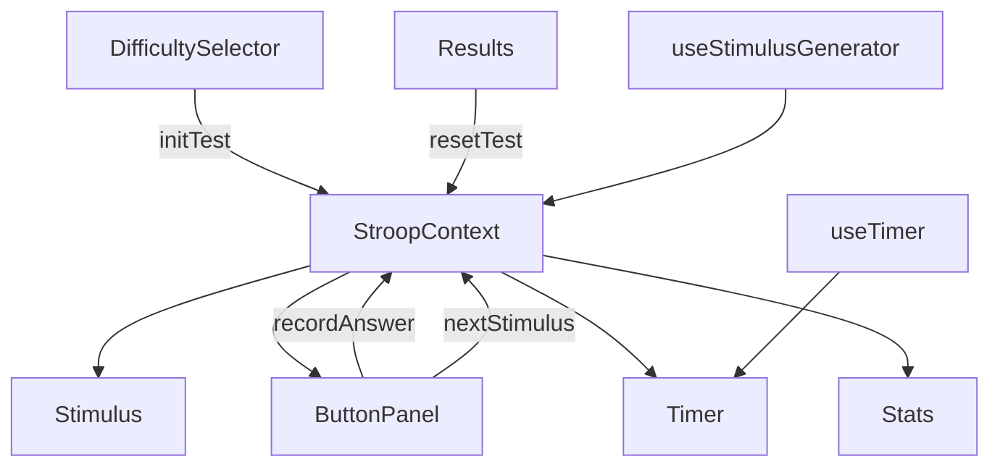

# Спецификация Stroop-теста

## 1. Функциональная спецификация

### 1.1. Общее описание
Stroop-тест — интерактивное веб-приложение для оценки когнитивного контроля. Пользователь видит слово, обозначающее цвет, написанное цветным шрифтом, и должен выбрать цвет шрифта, игнорируя семантическое значение слова.

### 1.2. Основные экраны
1. **Экран приветствия** — выбор уровня сложности, кнопка "Начать".
2. **Экран тестирования** — отображение стимула, панель кнопок, таймер, индикаторы.
3. **Экран результатов** — сводка метрик, кнопка "Повторить" или "Выйти".

### 1.3. Кнопки и действия
- **Кнопки выбора цвета** (количество зависит от уровня сложности):
  - Лёгкий уровень: 4 кнопки (красный, синий, зелёный, жёлтый)
  - Средний уровень: 5 кнопок (добавляется фиолетовый)
  - Сложный уровень: 6 кнопок (добавляется оранжевый)
  - Цвета и их CSS-значения:
    - Красный: `#FF0000`
    - Синий: `#0000FF`
    - Зелёный: `#00FF00`
    - Жёлтый: `#FFFF00`
    - Фиолетовый: `#800080`
    - Оранжевый: `#FFA500`
  - **Действие**: при нажатии фиксируется ответ, проверяется правильность, записывается время реакции, происходит переход к следующему стимулу.
- **Кнопка "Начать"** — инициирует сессию теста.
- **Кнопка "Пауза"** (опционально) — приостанавливает таймер.
- **Кнопка "Завершить досрочно"** — завершает сессию и показывает результаты.
- **Кнопка "Повторить"** — сбрасывает тест и начинает новую сессию.
- **Кнопка "История результатов"** — показывает сохранённые предыдущие попытки.

### 1.4. Генерация стимулов
- **Набор слов**: "КРАСНЫЙ", "СИНИЙ", "ЗЕЛЁНЫЙ", "ЖЁЛТЫЙ", "ФИОЛЕТОВЫЙ", "ОРАНЖЕВЫЙ".
- **Набор цветов**: соответствующие CSS-значения:
  - Красный: `#FF0000`
  - Синий: `#0000FF`
  - Зелёный: `#00FF00`
  - Жёлтый: `#FFFF00`
  - Фиолетовый: `#800080`
  - Оранжевый: `#FFA500`
- **Конгруэнтность**: слово и цвет могут совпадать (конгруэнтный) или не совпадать (неконгруэнтный).
- **Алгоритм генерации**:
  1. В зависимости от уровня сложности выбирается подмножество цветов:
     - Лёгкий: 4 цвета (красный, синий, зелёный, жёлтый)
     - Средний: 5 цветов (красный, синий, зелёный, жёлтый, фиолетовый)
     - Сложный: 6 цветов (красный, синий, зелёный, жёлтый, фиолетовый, оранжевый)
  2. Случайный выбор слова из выбранного подмножества.
  3. Случайный выбор цвета из того же подмножества.
  4. Определение конгруэнтности.
  5. Регулировка распределения конгруэнтных/неконгруэнтных в зависимости от уровня сложности.

### 1.5. Уровни сложности
1. **Лёгкий**:
   - 4 цвета: красный, синий, зелёный, жёлтый.
   - Случайное соотношение конгруэнтных/неконгруэнтных.
   - Нет ограничения по времени на ответ.
   - Минимум 30 стимулов.
2. **Средний**:
   - 5 цветов: красный, синий, зелёный, жёлтый, фиолетовый.
   - Случайное соотношение конгруэнтных/неконгруэнтных.
   - Ограничение времени на ответ — 3 секунды.
   - Если время истекло, фиксируется ошибка и переход к следующему стимулу.
   - Минимум 30 стимулов.
3. **Сложный**:
   - 6 цветов: красный, синий, зелёный, жёлтый, фиолетовый, оранжевый.
   - Только неконгруэнтные стимулы (100%).
   - Ограничение времени на ответ — 3 секунды.
   - Минимум 30 стимулов.

### 1.6. Метрики и расчёты
- **Время реакции (мс)**: интервал между показом стимула и нажатием кнопки.
- **Правильность**: булево значение (правильно/неправильно).
- **Среднее время реакции (СВР)**: сумма времени правильных ответов / количество правильных.
- **Скорость ответа (стимулов/мин)**: количество обработанных стимулов в минуту, вычисляется как `(общее количество стимулов / общее время сессии в минутах)`. Показывает, насколько быстро пользователь принимает решения.
- **Количество ошибок**: стимулы с неправильным ответом или истёкшим временем.
- **Индекс интерференции**: `СВР_неконгруэнтные - СВР_конгруэнтные`.
- **Точность (%)**: (правильные ответы / общее количество стимулов) * 100.
- **Общее время сессии**: от начала до завершения.

### 1.7. Сохранение данных
- **Сессия**: сохраняются все ответы с временем, правильностью, конгруэнтностью.
- **Итоговые метрики**: сохраняются после каждой сессии в `localStorage`.
- **История**: массив предыдущих сессий с датой, уровнем сложности, метриками.
- **Экспорт**: возможность скачать историю в формате CSV (дополнительный функционал).

## 2. Спецификация UI

### 2.1. Цветовая палитра
- **Основные цвета кнопок**:
  - Красный: `#FF0000` (фон), `#FFFFFF` (текст)
  - Синий: `#0000FF` (фон), `#FFFFFF` (текст)
  - Зелёный: `#00FF00` (фон), `#000000` (текст)
  - Жёлтый: `#FFFF00` (фон), `#000000` (текст)
  - Фиолетовый: `#800080` (фон), `#FFFFFF` (текст)
  - Оранжевый: `#FFA500` (фон), `#000000` (текст)
- **Фон приложения**: `var(--bg)` (светлый/тёмный режим)
- **Текст**: `var(--text)` и `var(--text-h)`
- **Акцентный цвет**: `var(--accent)` (фиолетовый)
- **Границы**: `var(--border)`

### 2.2. Расположение элементов
```
┌─────────────────────────────────────┐
│           Таймер                    │
│                                     │
│          СТИМУЛ                     │
│      (слово цветным шрифтом)        │
│                                     │
│  [Красный] [Синий] [Зелёный] [Жёлтый] │
│                                     │
│  Индикаторы:                        │
│  Стимулов: 5/30   Ошибок: 1         │
│  Уровень: Средний                   │
│                                     │
│  [Пауза] [Завершить досрочно]       │
└─────────────────────────────────────┘
```

### 2.3. Размеры и отступы
- **Стимул**: шрифт 72px, жирный, центрирован.
- **Кнопки цвета**: 120px × 60px, скругление 12px, отступ между кнопками 20px.
- **Таймер**: шрифт 24px, верхний правый угол.
- **Индикаторы**: шрифт 16px, расположены под кнопками.
- **Контейнер**: максимальная ширина 800px, центрирован, отступы по краям 20px.
- **Адаптивность**:
  - На мобильных устройствах (ширина < 768px) кнопки располагаются в 2 колонки.
  - Размер шрифта стимула уменьшается до 48px.
  - Отступы уменьшаются.

### 2.4. Адаптивность
- **Десктоп (≥1024px)**: горизонтальное расположение кнопок, полная ширина.
- **Планшет (768px‑1023px)**: кнопки в одну строку, но с меньшими отступами.
- **Мобильный (<768px)**: кнопки в 2 колонки, стимул меньше, индикаторы вертикально.

### 2.5. Анимации и переходы
- Появление стимула: fade-in 0.3s.
- Нажатие кнопки: scale-down 0.1s.
- Переход между стимулами: fade-out 0.2s, пауза 500ms, fade-in 0.3s.
- Таймер: плавное обновление каждую секунду.

## 3. Архитектурная спецификация

### 3.1. Технологический стек
- **Frontend**: React 19 с TypeScript
- **Сборка**: Vite
- **Стилизация**: CSS Modules (можно использовать Tailwind CSS опционально)
- **Тестирование**: Vitest + React Testing Library
- **Хранение состояния**: React Context + useReducer
- **Визуализация**: Recharts (для графиков в дополнительном функционале)
- **Деплой**: Vercel / Netlify

### 3.2. Структура проекта
```
src/
├── assets/               # Статические ресурсы
├── components/           # React-компоненты
│   ├── Stimulus/        # Отображение стимула
│   ├── ButtonPanel/     # Панель кнопок выбора цвета
│   ├── Timer/           # Таймер сессии
│   ├── Results/         # Экран результатов
│   ├── Stats/           # Блок статистики (индикаторы)
│   ├── DifficultySelector/ # Выбор уровня сложности
│   └── History/         # История результатов (дополнительно)
├── context/             # React Context провайдеры
│   └── StroopContext.tsx
├── hooks/               # Пользовательские хуки
│   ├── useStimulusGenerator.ts
│   ├── useTimer.ts
│   ├── useMetrics.ts
│   └── useLocalStorage.ts
├── utils/               # Вспомогательные функции
│   ├── stimulus.ts      # Генерация стимулов
│   ├── metrics.ts       # Расчёт метрик
│   ├── constants.ts     # Константы (цвета, слова)
│   └── helpers.ts       # Общие утилиты
├── types/               # TypeScript типы
│   └── index.ts
└── App.tsx              # Корневой компонент
```

### 3.3. Состояние (Store)
Используется React Context с useReducer. Состояние включает:

```typescript
interface StroopState {
  // Сессия
  sessionId: string;
  difficulty: 'easy' | 'medium' | 'hard';
  status: 'idle' | 'running' | 'paused' | 'completed';
  
  // Стимулы
  stimuli: Stimulus[];
  currentStimulusIndex: number;
  currentStimulus: Stimulus | null;
  
  // Ответы
  answers: Answer[];
  
  // Таймер
  startTime: number | null;
  elapsedTime: number;
  reactionTimer: number | null;
  
  // Метрики
  metrics: Metrics | null;
}

interface Stimulus {
  id: string;
  word: string;
  color: string;
  isCongruent: boolean;
  shownAt: number;
}

interface Answer {
  stimulusId: string;
  selectedColor: string;
  correct: boolean;
  reactionTime: number;
  timestamp: number;
}

interface Metrics {
  totalStimuli: number;
  correctAnswers: number;
  errors: number;
  avgReactionTime: number;
  avgReactionTimeCongruent: number;
  avgReactionTimeIncongruent: number;
  interferenceIndex: number;
  accuracy: number;
  totalTime: number;
  speed: number; // скорость ответа (стимулов/мин)
}
```

### 3.4. Экшены (Actions)
Редьюсер поддерживает следующие экшены:

1. **`initTest`** — запуск сессии:
   - Параметры: `difficulty`
   - Генерирует 30 стимулов, сбрасывает ответы, устанавливает статус `running`, записывает `startTime`.

2. **`recordAnswer`** — обработка ответа пользователя:
   - Параметры: `selectedColor`
   - Вычисляет правильность, время реакции, добавляет ответ в массив `answers`.

3. **`nextStimulus`** — переход к следующему стимулу:
   - Увеличивает `currentStimulusIndex`, обновляет `currentStimulus`.
   - Если достигнут конец сессии, автоматически вызывает `completeTest`.

4. **`completeTest`** — завершение теста:
   - Вычисляет итоговые метрики, сохраняет в `metrics`.
   - Меняет статус на `completed`.
   - Сохраняет сессию в `localStorage`.

5. **`resetTest`** — сброс теста:
   - Возвращает состояние в исходное (idle), очищает стимулы, ответы, метрики.

6. **`pauseTest`** — пауза теста (опционально).
7. **`resumeTest`** — возобновление теста.

### 3.5. Компоненты и их ответственность
- **`Stimulus`**: отображает слово с цветным шрифтом. Получает `currentStimulus` из контекста.
- **`ButtonPanel`**: рендерит четыре цветные кнопки. При нажатии диспатчит `recordAnswer` и `nextStimulus`.
- **`Timer`**: показывает прошедшее время сессии. Использует хук `useTimer`.
- **`Stats`**: отображает индикаторы (количество стимулов, ошибок, уровень сложности).
- **`Results`**: показывает итоговые метрики после завершения. Кнопки "Повторить" (диспатчит `resetTest` и `initTest`) и "История".
- **`DifficultySelector`**: экран выбора уровня сложности перед началом теста.

### 3.6. Пользовательские хуки
- **`useStimulusGenerator`**: генерирует массив стимулов в зависимости от уровня сложности.
- **`useTimer`**: управляет таймером сессии и реакций, возвращает форматированное время.
- **`useMetrics`**: вычисляет метрики на основе массива ответов.
- **`useLocalStorage`**: сохраняет и загружает историю сессий.

### 3.7. Взаимодействие компонентов


### 3.8. Типизация
Все сущности типизированы с TypeScript. Интерфейсы экспортируются из `types/index.ts`.

## 4. Дополнительный функционал (опционально)
- **Визуализация распределения времени реакции** — гистограмма с использованием Recharts.
- **Ограничение по времени выполнения** — режим "на время" (60 секунд).
- **История результатов** — таблица с предыдущими попытками, фильтрация по уровню сложности.
- **Экспорт в CSV** — кнопка для скачивания истории.
- **Мультиплеер** — соревнование двух игроков по сети (WebSockets).
- **PWA** — установка приложения на мобильные устройства.

## 5. Тестирование
- **Модульные тесты**: генерация стимулов, расчёт метрик.
- **Интеграционные тесты**: взаимодействие компонентов с контекстом.
- **E2E тесты**: Cypress или Playwright для полного сценария.

---
*Документ создан на основе README.md и уточнений от пользователя. Версия 1.0.*